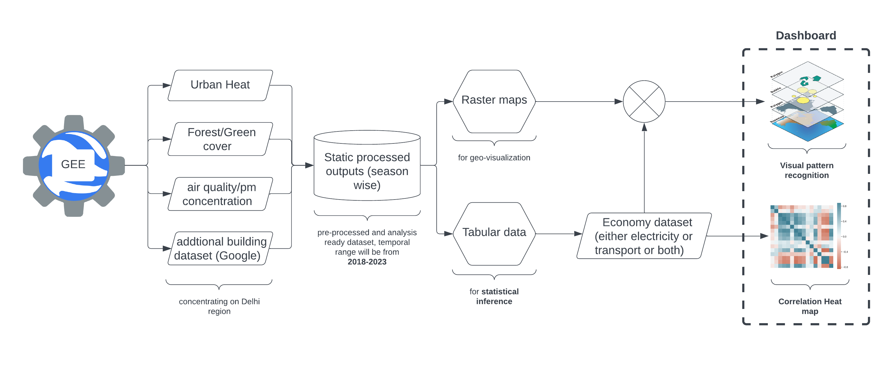

## **Introduction**

This repository is a part of **[UN Datathon 2023](https://unstats.un.org/bigdata/events/2023/un-datathon/) ** which had the theme of SDG Localization focusing on a) Local advocacy, to generate a deeper understanding of the imperative of Localization to accelerate the SDG transitions, b) Local action, to facilitate local implementation through technology, capacity building, and financing, and c) Local monitoring and reporting on SDG implementation, including exchange of knowledge and perspectives. (Source: [Local2030 Coalition: Pushing key transitions and achieving the SDGs by 2030](https://hlpf.un.org/sites/default/files/2023-09/Local2030%20Brochure.pdf))

## **The six key transitions**

* [**food systems**](https://hlpf.un.org/sites/default/files/2023-09/Food%20Systems%20Transformation%20Brochure.pdf)**;**
* [**energy access and affordability**](https://hlpf.un.org/sites/default/files/2023-09/Energy%20Compacts%20Brochure_1.pdf)**;**
* [**digital connectivity**](https://hlpf.un.org/sites/default/files/2023-09/Digital%20Public%20Infrastructure%20Brochure.pdf)**;**
* [**education**](https://hlpf.un.org/sites/default/files/2023-09/Transforming%20Education%20Brochure.pdf)**;**
* [**jobs and social protection**](https://hlpf.un.org/sites/default/files/2023-09/Global%20Accelerator%20Brochure_0.pdf)**; and**
* [**climate change**](https://www.un.org/climatechange/climate-ambition-summit)**, **[**biodiversity loss**](https://hlpf.un.org/sites/default/files/2023-09/Nature%20Driving%20Economic%20Transformation%20Brochure_1.pdf) ** and pollution*** **.**

[*: Pollution is a multifaceted issue and there is no single summit document which covers it in a comprehensive way.]

Out of the 6 key transitions our team focused on climate change, air pollution, and part of energy access and affordability.

## Methodology

1. The process mainly comprises of use of Google Earth Engine to do analysis over satellite data and fetch information regarding Land Surface Temperature, Forest/Green cover, and air quality. Additionally building dataset from [Google Open Building](https://sites.research.google/open-buildings/) website was taken and clipped using python.
2. Then the output rasters and vector were taken to QGIS where they zonal statistics were performed to fetch tabular dataset for further analysis.
3. Eonomy data of electricity were taken from [Central Electricity Authority](https://cea.nic.in/dashboard/?lang=en) website (open-source dashboard).
4. Combining these raster dataset was used to create an interactive website/dashboard along with correlation heat map generated from the tabular data using python.

## Output

* [Felt Website](https://felt.com/map/UN-Datathon-2023-Team-Turtles-Uu9AikALfRzWxjQkUKTf9AKB?loc=28.7255,76.9136,10.16z&share=1)
